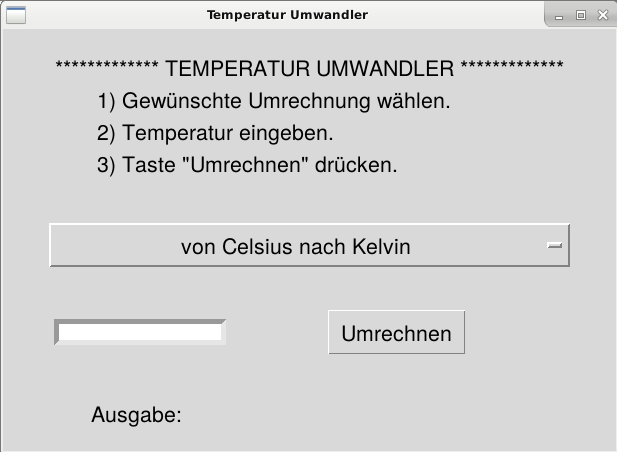
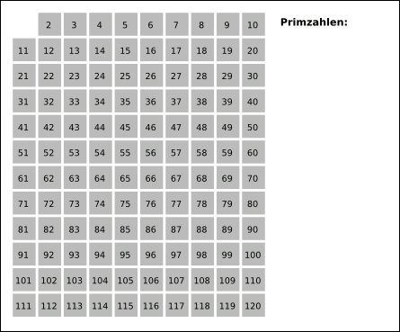
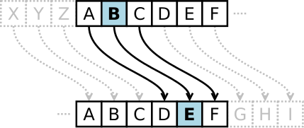

:tocdepth: 3

****************
Aufgabensammlung
****************

In diesem Kapitel findest du eine Sammlung von Aufgaben. Die Aufgaben sind in
vier Teilgebiete gegliedert.

Am Anfang jeder Aufgabe ist eine Liste der Kapiteln vorgegeben, die
man für das Lösen gelesen haben soll. Zu jeder Aufgabe gibt es eine
Musterlösung. Die Musterlösungen sind ``.py``-files und können heruntergeladen
werden. Die Kommentare am Anfang der Dateien können ignoriert werden.  Diese
Dateien können auf zwei Arten ausgeführt werden:

- File mit IDLE öffnen und Programm mit der F5-Taste (Run -> Run Module) 
  ausführen.
- Befehl ``python3 filename.py`` im Terminal eingeben. Man muss aber zuerst im
  richtigen Verzeichnis sein. Zum Beispiel, wenn die Datei im Verzeichnis
  *Home->Workspace->PythonWorkspace* gespeichert wurde, muss man zuerst mit
  ``cd Home/Workspace/PythonWorkspace`` sich verlagern (``cd`` bedeutet *change
  directory*).

Ausserdem gibt es Zusatzaufgaben, für die keine Musterlösung vorhanden ist.

Allgemein
=========

Hello World! I'm...
-------------------

**Vorkenntnisse:** Kapitel 1.

Erstelle ein Programm, das deinen Vorname, Nachname und Geburtsdatum auf der
Konsole aufdruckt.

**Musterlösung:**
:download:`hello_i_am.py <code/musterloesungen/hello_i_am.py>`.

**Zusatzaufgabe:** Erweitere dein Programm, indem es auch zum Beispiel deine 
Adresse oder dein Telefonnummer aufdruckt.

Winkelmass Umwandler
--------------------

**Vorkenntnisse:** Kapitel 1 bis 3.

Schreibe ein Programm, das, gegeben einen Winkel in Bogenmass, den 
entsprechenden Winkel in Gradmass berechnet. Die Ausgabe muss mit Grad (°),
Bogenminuten (\') und Bogensekunden (\") aufgewiesen werden.

Hinweise:

- Die Zahl :math:`\pi` kannst du vom Modul ``math`` importieren, indem du
  folgendes Befehl am Anfang deines Programms schreibst:
  ``from math import pi``. Du kannst dann im Programm mit der Variable ``pi``
  arbeiten.
- Überlege dir, wie man die zwei Befehle :py:func:`input()` und 
  :py:func:`float()` benutzen kann, um eine Flieskommazahl lesen zu können.

**Musterlösung:**
:download:`bogen_nach_gradmass.py 
<code/musterloesungen/bogen_nach_gradmass.py>`.

**Zusatzaufgabe:** Schreibe ein anderes Programm, das die umgekehrte Umrechnung
durchführt.

Temperatur Umwandler
--------------------

**Vorkenntnisse:** Kapitel 1 bis 5.

Schreibe ein Programm, das Temperaturen in verschiedenen Skalensystemen
umwandelt. Das Programm soll ein Anfangsmenü mit den verschiedenen
Möglichkeiten haben::

   (1) Umrechnung von Celsius nach Kelvin
   (2) Umrechnung von Celsius nach Fahrenheit
   (3) Umrechnung von Kelvin nach Celsius
   (4) Umrechnung von Kelvin nach Fahrenheit
   (5) Umrechnung von Fahrenheit nach Celsius
   (6) Umrechnung von Fahrenheit nach Kelvin

Achte auf folgende Bemerkungen:

- Celsius = 5/9 * (Fahrenheit - 32).
- Celsius = Kelvin - 273.15.
- Die tiefste mögliche Temperatur ist den absoluten Nullpunkt ``0K``.

Hinweise:

- Benutze die :py:keyword:`if`-:py:keyword:`elif`-:py:keyword:`else`
  Verzweigung.

**Musterlösung:** :download:`temperatur_umwandler.py 
<code/musterloesungen/temperatur_umwandler.py>`.

**Zusatzaufgabe:** Passe deine Lösung der Aufgabe `Winkelmass Umwandler`_ so an,
dass beide Umrechnungen (Bogen- nach Gradmass und umgekehrt) in einem einzelnen
Programm möglich sind.

Mit Funktionen
--------------

**Vorkenntnisse:** Kapitel 1 bis 6.

Erweitere deine Lösung der vorherige Aufgabe, indem du für die
Umrechnung 6 verschiedene Funktionen definierst. Passt ausserdem dein
Programm so an, dass der Benutzer mehrere Temperaturen nacheinander umrechnen
kann und selber dann das Programm beenden kann.

Hinweise:

- Bei der Implementierung von Programmen braucht man einige konstante Werte
  (zum Beispiel brauchst du in dieser Aufgabe den Wert des absoluten Nullpunktes
  :math:`-273.15` in Celsius-Skala).
  Es ist lohnenswert, solche Konstanten am Anfang des Programms
  zu definieren. In einiger Programmiersprache gibt es sogar die Möglichkeit, 
  \"Variablen\" zu definieren, deren Wert nicht geändert werden kann. In Python
  gibt allerdings diese Möglichkeit nicht. Per Konvention benennt der Ersteller
  die Konstanten mit grossgeschriebenen Namen
  (z.B. ``ABSOLUTER_NP_C = -273.15``).
- Um nach einer Eingabe dem Benutzer zu fragen, kannst du folgende Funktion
  benutzen:

	.. literalinclude:: code/exception_muster.py
	    	  :linenos:

  Diese Funktion hat ein optionales Argument ``msg``. Wenn die Funktion ohne
  Argumente aufgerufen wird, nimmt ``msg`` den vorgegebenen Wert
  ``"Bitte Zahl eingeben: "``. Falls der Benutzer eine Zahl eingibt, so wird
  diese zurückgegeben. Andere Eingaben werden allerdings nicht akzeptiert: das
  Programm erkennt ungültige Eingabe mit der Ausnahmebehandlung
  (:py:keyword:`try`-:py:keyword:`except`) und fragt unmittelbar nach einer
  anderen Eingabe.
- Analog kannst du ungültige Eingabewerte für die Temperatur mit
  :py:keyword:`raise` wie im folgenden Beispiel (Funktion für die Umrechnung von
  Celsius nach Kelvin) überprüfen:

	.. literalinclude:: code/exception_muster2.py
	    	  :linenos:

**Musterlösung:** :download:`temperatur_umwandler_erweiterung.py 
<code/musterloesungen/temperatur_umwandler_erweiterung.py>`.

**Zusatzaufgabe:** Erweitere die Lösung der vorherigen Zusatzaufgabe (Winkelmass
Umwandler), indem du Funktionen implementierst.

Mit GUI
-------

**Vorkenntnisse:** Kapitel 1 bis 8.

Versuche deine Lösung von vorherigen Aufgabe mit einer
graphische Benutzeroberfläche zu erweitern. Die Fenster soll folgende Elemente
enthalten:

- ein OptionMenu Widget für die Wahl der Umrechnung (Celsius nach Kelvin, ...).
- ein Entry Widget, für die Eingabe der Temperatur.
- ein Label Widget, für die Ausgabe.
- ein Button Widget, der die Umrechnung startet.

Für die Erstellung des OptionMenus kannst du folgendes Muster anpassen:

	.. literalinclude:: code/optionmenu_muster.py
	    	  :linenos:

   Beispiel eines möglichen Layouts des Fensters.

**Musterlösung:** :download:`temperatur_gui.py
<code/musterloesungen/temperatur_gui.py>`.

**Zusatzaufgabe:** Erstelle auch für den Winkelmass Umwandler eine GUI.

Sortierprogramm
---------------

**Vorkenntnisse:** Kapitel 1 bis 4.

Schreibe ein Programm, welches eine Liste von ganzen Zahlen wachsend sortiert.
Die Elementen der Liste werden nacheinander den Benutzer gefragt. Der Benutzer
soll so viele Elementen eingeben, wie er will. Wenn er mit der Eingabe fertig
ist, soll er mit einem Befehl (zum Beispiel ``q`` eingeben) die Eingabe
beenden.

Hinweis: :py:keyword:`while`

**Musterlösung:** :download:`sortierprogramm.py 
<code/musterloesungen/sortierprogramm.py>`.

**Zusatzaufgabe:** Schreibe ein anderes Programm, das eine Liste von
Zeichenkette alphabetisch sortiert.

Prof. Ungerechtmann
-------------------

**Vorkenntnisse:** Kapitel 1 bis 5.

Professor Ungerechtmann der Kantonsschule Unfairdorf braucht ein Programm für
die Notenvergabe der Abschlussprüfung. Die Abschlussnote hängt von folgenden
Parameter ab:

- Prüfungsnote (von 1 bis 6 mit Halbpunkten);
- Augenfarbe (z.B. dunkel=1, hell=0);
- Frisur (z.B. kurze Haare=1, lange Haare=0);
- Wetter (z.B. schön=1, nicht schön=0).

Es gilt Folgendes:

- Hat der Prüfling dunkle Augen und...

  - kurze Haare, so wird die Abschlussnote um 10\% erhöht 
    (d.h. Abschlussnote = Prüfungsnote + 10\% Prüfungsnote).
  - lange Haare, so wird die Abschlussnote um 10\% reduziert.

- Hat der Prüfling helle Augen und...

  - kurze Haare, so wird die Abschlussnote um 10\% reduziert.
  - lange Haare, so wird die Abschlussnote um 10\% erhöht.
  
- Ist das Wetter schön, so wird die Abschlussnote um eine Einheit
  reduziert.
- Die Abschlussnoten müssen auf halbe Noten gerundet werden.

Hinweis: Wie kann man auf halbe Noten runden? Die Funktion :py:func:`round()`
rundet auf ganze Noten, z.B. ``round(5.4) = 5`` aber ``round(5.4*2) = 11``... ;)

**Musterlösung:** :download:`ungerechtmann.py 
<code/musterloesungen/ungerechtmann.py>`.

**Zusatzaufgabe:** Erfinde und implementiere einige neue Bedingungen, von denen 
die Abschlussnote abhängt.

Flache Steuern
--------------

**Vorkenntnisse:** Kapitel 1 bis 5.

Der Steueramtchef von Flächenland stellt dich an, um ein einfaches Programm in
Python zu schreiben. Dieses Programm soll den Steuersatz jedes Steuerzahlers
berechnen. Die Eigabeparameter sind:

- Vorname und Nachname des Steuerzahlers
- Einkommen (in Dublonen, die Währung von Flächenland)

Die Ausgabe soll folgender Form sein:

   ``Der Steuerzahler Vorname Nachname muss für das laufende Jahr X Dublonen dem
   Steueramt bezahlen.``

Der Steuersatz ist gemäss folgender Tabelle bestimmt:

=============================  ==============
**Einkommen** :math:`E`        **Steuersatz**
-----------------------------  --------------
:math:`E \le 10'000`           40\%
:math:`10'000 < E \le 30'000`  55\%
:math:`30'000 < E \le 70'000`  75\%
:math:`E > 70'000`             82\%
=============================  ==============

**Musterlösung:** :download:`flache_steuern.py 
<code/musterloesungen/flache_steuern.py>`.

**Zusatzaufgabe:** Berücksichtige in deinem Programm neben das Einkommen
auch die Habseligkeit.

=================================  ==============
**Habseligkeit** :math:`H`         **Steuersatz**
---------------------------------  --------------
:math:`H \le 100'000`              5\%
:math:`100'000 < H \le 500'000`    8\%
:math:`500'000 < H \le 1'000'000`  13\%
:math:`H > 1'000'000`              21\%
=================================  ==============

Hat zum Beispiel ein Steuerzahler :math:`25'000` Dublonen Einkommen und 
:math:`600'000` Dublonen Habseligkeit, so muss er

.. math:: 25'000 \cdot \frac{55}{100} + 600'000 \cdot \frac{13}{100} = 91'750

Dublonen dem Steueramt bezahlen.

Mathematische Probleme
======================

Sum that
--------

**Vorkenntnisse:** Kapitel 1 bis 5.

Erstelle ein Programm, das die Summe aller natürliche Zahlen :math:`n \le 10000`
mit :math:`7 \mid n` und :math:`5 \nmid n` berechnet.

**Musterlösung:** :download:`sum_that.py 
<code/musterloesungen/sum_that.py>`.

**Zusatzaufgabe:** *List comprehension* ist ein syntaktisches Konstrukt, um 
Listen zu erzeugen. Schau hier wie es in Python funktioniert:
https://docs.python.org/3.3/tutorial/datastructures.html#list-comprehensions.
Versuche nachher mit diesem Konstrukt ein äquivalentes Programm zu schreiben.

Quadratische Gleichungen
------------------------

**Vorkenntnisse:** Kapitel 1 bis 5.

Erstelle ein Programm zur Lösung von quadratische Gleichungen

.. math:: ax^2 + bx + c = 0.

Die reellen Koeffizienten :math:`a, b, c` sind den Benutzer gefragt.

Hinweise:

- Das Programm kann man elegant gestalten, indem man am Anfang verschiedene
  Fälle unterscheidet. Was passiert zum Beispiel wenn :math:`a=0`? Wenn 
  :math:`b^2-4ac < 0`? ...
- Analog wie die Zahl :math:`\pi` kann die quadratische Wurzel (``sqrt``) mit
  ``from-import`` vom Module ``math`` importiert werden.

**Musterlösung:** :download:`quadratische_gleichungen.py 
<code/musterloesungen/quadratische_gleichungen.py>`.

**Zusatzaufgabe:** Gegeben eine quadratische Funktion :math:`f(x) = ax^2+bx+c`
durch den Koeffizienten ``a, b, c`` und eine lineare Funktion
:math:`g(x) = mx + q` durch ``m, q``, erstelle ein Programm, das
die Schnittpunkte von :math:`f` und :math:`g` findet.

Zahlenfolge
-----------

**Vorkenntnisse:** Kapitel 1 bis 5.

Sei :math:`n \in \mathbb N`. Es gelten folgende Regeln:

- Falls :math:`3 \mid n`, dann soll :math:`n` um 4 erhöht.
- Falls :math:`3 \nmid n` aber :math:`4 \mid n`, dann soll :math:`n` halbiert
  werden.
- Falls :math:`3 \nmid n` und :math:`4 \nmid n`, dann soll :math:`n` um 1
  verkleinert.

Man soll sukzessiv vorherige Regeln anwenden, bis :math:`n = 0`. Zum Beispiel,
für :math:`n = 7` hat man:

.. math:: 7 \rightarrow 6 \rightarrow 10 \rightarrow 9 \rightarrow 13
          \rightarrow 12 \rightarrow 16 \rightarrow 8 \rightarrow 4 \rightarrow
          2 \rightarrow 1 \rightarrow 0.

In diesem Fall braucht man 11 Schritte, um 0 zu erreichen.

Schreibe ein Programm, das, gegeben zwei natürliche Zahlen ``a`` und ``b`` mit 
``a < b``, auf der Konsole die Anzahl benötigte Schritte für jede
:math:`a \le n \le b` veranschaulichen. Zum Beispiel soll die Ausgabe für
``a = 1`` und ``b = 7`` folgende sein::

	1 -> 1
	2 -> 2
	3 -> 12
	4 -> 3
	5 -> 4
	6 -> 10
	7 -> 11

**Musterlösung:** :download:`anzahl_schritte.py 
<code/musterloesungen/anzahl_schritte.py>`.

**Zusatzaufgabe:** Das `Collatz-Problem`_ ist ein ungelöstes mathematisches 
Problem. Es handelt sich um eine Zahlenfolge, die in den Zyklus 4-2-1 mündet,
unabhängig davon, welche Startzahl :math:`n` wählt. Schau zuerst wie die Folge 
definiert ist und erstelle dann ein Programm, welches gegeben
eine Startzahl, die Anzahl benötigten Schritte für die Erreichung des Zyklus
4-2-1 berechnet.

.. _`Collatz-Problem`: http://de.wikipedia.org/wiki/Collatz-Problem

PPDI
----

**Vorkenntnisse:** Kapitel 1 bis 5.

Die **narzisstischen Zahlen** sind eine Teilmenge natürlicher Zahlen, die durch
bestimmte Rechenvorschriften ihrer Ziffern sich selbst erzeugen
(siehe http://de.wikipedia.org/wiki/Narzisstische_Zahl).

Die **PPDI** (*Pluperfect digital invariants*, auch *Armstrong-Zahlen*) sind
narzisstische Zahlen, deren Summe ihrer Ziffern, jeweils potenziert mit der
Stellenanzahl der Zahl, wieder die Zahl selbst ergibt.
Zum Beispiel ist 371 eine PPDI:

.. math:: 371 = 3^3 + 7^3 + 1^3.

Schreibe ein Programm, das alle die PPDI mit drei Ziffern bestimmt.

**Musterlösung:** :download:`ppdi.py <code/musterloesungen/ppdi.py>`.

153
---

**Vorkenntnisse:** Kapitel 1 bis 6.

Sei :math:`n>0` eine ganze Zahl, die durch 3 teilbar ist (zum Beispiel 86145).
Die Summe der dritten Potenzen der Ziffern ist wieder eine Zahl, die durch 3
teilbar ist:

.. math:: 8^3+6^3+1^3+4^3+5^3 = 918.

Von dieser neue Zahl kann man nochmals die Summe der dritten Potenzen der
Ziffern berechnen und diese ist wieder durch 3 teilbar
(:math:`9^3+1^3+8^3 = 1242`), usw.
Man kann beweisen, dass dieser Vorgang irgendwann zum Fixpunkt 153 kommt.
Bemerke, dass 153 eine PPDI ist (:math:`1^3+5^3+3^3 = 153`).

Erstelle ein Programm, das diese Tatsache verifiziert. Im Programm musst du
eine Funktion :py:func:`quersumme_dritter_potenzen()` definieren. Diese Funktion
nimmt als Argument eine ganze Zahl und gibt als Rückgabewert die Summe der
dritten Potenzen der Ziffern dieser Zahl.

**Musterlösung:** :download:`hundertdreiundfuenfzig.py 
<code/musterloesungen/hundertdreiundfuenfzig.py>`.

Sieb des Eratosthenes
---------------------

**Vorkenntnisse:** Kapitel 1 bis 6.

Das Sieb des Eratosthenes ist ein Algorithmus zur Bestimmung einer Liste oder
Tabelle aller Primzahlen kleiner oder gleich einer vorgegebenen Zahl.
Von http://de.wikipedia.org/wiki/Sieb_des_Eratosthenes:

	Zunächst werden alle Zahlen 2, 3, 4, ... bis zu einem frei wählbaren 
	Maximalwert N aufgeschrieben. Die zunächst unmarkierten Zahlen sind 
	potentielle Primzahlen. Die kleinste unmarkierte Zahl ist immer eine 
	Primzahl. Nachdem eine Primzahl gefunden wurde, werden alle Vielfachen 
	dieser Primzahl als zusammengesetzt markiert. Man bestimmt die 
	nächstgrössere nicht markierte Zahl. Da sie kein Vielfaches von Zahlen 
	kleiner als sie selbst ist (sonst wäre sie markiert worden), kann sie 
	nur durch eins und sich selbst teilbar sein. Folglich muss es sich um 
	eine Primzahl handeln. Diese wird dementsprechend als Primzahl 
	ausgegeben. Man streicht wieder alle Vielfachen und führt das Verfahren 
	fort, bis man am Ende der Liste angekommen ist. Im Verlauf des Verfahren
	werden alle Primzahlen ausgegeben.

	Da ein Primfaktor einer zusammengesetzten Zahl immer kleiner gleich der 
	Wurzel der Zahl sein muss, ist es ausreichend, nur die Vielfachen von 
	Zahlen zu streichen, die kleiner oder gleich der Wurzel der Schranke N
	sind.

   Beispiel mit N = 120. Quelle: 
   http://de.wikipedia.org/wiki/Sieb_des_Eratosthenes

Schreibe ein Programm, das, gegeben eine natürliche Zahl :math:`N \ge 2`, die
Liste aller Primzahlen kleiner oder gleich N erzeugt.

Das Programm soll folgende Struktur haben:

- Eine Funktion ``sieb()`` mit ``N`` als Eingabeparameter und die Liste der
  Primzahlen kleiner oder gleich ``N`` als Rückgabe.
- Eine Funktion ``main()``, in der den Benutzer nach der Eingabe gefragt wird
  und die Funktion ``sieb()`` aufruft.
- Der Aufruf der ``main()``-Funktion.

Als Test für dein Programm benutze folgende Tatsache: die Anzahl Primzahlen
kleiner 1'000'000 ist 78'498.

**Musterlösung:** :download:`sieb.py <code/musterloesungen/sieb.py>`.

Zeitmessung
-----------

**Vorkenntnisse:** Kapitel 1 bis 6.

Passe deine Lösung der Aufgabe `Sieb des Eratosthenes`_ so an, dass das Programm
neben der Liste der Primzahlen, auch die von der Funktion ``sieb()`` benötigte 
Zeit angibt.

Hinweis: Schau dir was die Funktion :py:func:`time.time()` von Module ``time``
macht.

**Musterlösung:** :download:`sieb_zeit.py
<code/musterloesungen/sieb_zeit.py>`.

Primfaktorzerlegung
-------------------

**Vorkenntnisse:** Kapitel 1 bis 6.

Mit Hilfe vom Sieb des Eratosthenes, erstelle ein Programm, der die
Primfaktorzerlegung einer natürliche Zahl bestimmt.

**Musterlösung:** :download:`primfaktorzerlegung.py
<code/musterloesungen/primfaktorzerlegung.py>`.

**Zusatzaufgabe:** Mit Hilfe der Programme, die du geschrieben hast, erstelle 
nun ein weiteres Programm, welches gegeben eine Zahl :math:`n`, alle die
vollkommene Zahlen kleiner oder gleich :math:`n` findet. Was eine vollkommene
Zahl ist, kannst du hier lesen: http://de.wikipedia.org/wiki/Vollkommene_Zahl.

Monty Hall Problem
------------------

**Vorkenntnisse:** Kapitel 1 bis 8.

Das Monty-Hall-Problem (auch Ziegenproblem) ist eine Aufgabe mit Bezug zur
Wahrscheinlichkeitstheorie. Aus http://de.wikipedia.org/wiki/Ziegenproblem:

	Nehmen Sie an, Sie wären in einer Spielshow und hätten die Wahl
	zwischen drei Toren. Hinter einem der Türen ist ein Auto, hinter den 
	anderen sind Ziegen. Sie wählen eine Tür, sagen wir, Tür A, und 
	der Showmaster, der weiss, was hinter den Türen ist, öffnet eine andere 
	Tür, sagen wir, Tür C, hinter dem eine Ziege steht. Er fragt Sie nun:
	\"Möchten Sie die Tür B?\" Ist es von Vorteil, die Wahl der Tür zu 
	ändern?

Selbst wenn du nicht antworten kannst, versuch nun dieses Spiel zu 
implementieren.

.. note:: Es gibt keine *richtige* oder *falsche* Art, ein solches Programm zu
	  schreiben. Hier gibt es aber einige Hinweise, die für die Erstellung
	  nützlich sein können. Du musst sie aber nicht unbedingt befolgen!

Hinweise:

- ``indicate_goat(n)``: eine Funktion, die gegeben die gewählte Tür
  (``n=0,1`` oder ``2``) eine andere Tür zeigt, hinter welcher eine Ziege ist.
  (Aufpassen: Falls der Spieler am Anfang "eine Ziege wählt", gibt es nur eine
  Möglichkeit. Falls er aber "das Auto wählt", kann der Showmaster eine der
  beiden anderen Türen öffnen und damit das Spiel fair bleibt, soll er
  zufälligerweise entscheiden.)
- Die drei Türen können als Buttons implementiert werden. In diesem Fall soll
  man drei Funktionen definieren (z.B. ``def doorA_action()``, ...).
  das Programm soll aber irgendwie die zwei Situationen (erste oder
  zweite Wahl) erkennen.
- Hilfreiche Funktion: :py:func:`configure()` (siehe
  https://docs.python.org/3.3/library/tkinter.html#setting-options). Zum
  Beispiel ``doorA.configure(state=DISABLED)`` deaktiviert Button ``doorA``.

**Musterlösung:** :download:`monty_hall.py 
<code/musterloesungen/monty_hall.py>`. Diese Musterlösung enthält 3
Bilder. Um diese Datei korrekt auszuführen muss man auch diese Bilder
herunterladen:
:download:`door.gif <code/musterloesungen/door.gif>`,
:download:`fiat500.gif <code/musterloesungen/fiat500.gif>`,
:download:`Boer-Goat.gif <code/musterloesungen/Boer-Goat.gif>`.

**Zusatzaufgabe:** Bereiche dein Programm. Menüleiste, Informationen über die
Version oder der Entwickler, Laute, ...

Objektorientierte Aufgaben
==========================

Fahrrad
-------

**Vorkenntnisse:** Kapitel 1 bis 7.

Erstelle eine Klasse ``Fahrrad``. Die Instanzen dieser Klasse sollen folgende
Attribute besitzen:

- eine Zeichenkette ``__marke`` (private): die Attribut beschreibt die Marke des
  Fahrrads
- die positive ganze Zahl ``__anz_zahnkraenze`` (private): diese Attribut
  beschreibt die Anzahl Zahnkränze des Fahrrads.
- die positive ganze Zahl ``__anz_ritzel`` (private): diese Attribut beschreibt
  die Anzahl Ritzel des Fahrrads.
- die positive ganze Zahl ``_zahnkranz`` (protected): diese Attribut beschreibt
  den gegenwärtige Zahnkranz des Fahrrads.
- die positive ganze Zahl ``_ritzel`` (protected): diese Attribut beschreibt das
  gegenwärtige Ritzel des Fahrrads.

Ausserdem soll die Klasse folgenden Methoden besitzen:

- ``get_marke()``: gibt die Marke zurück.
- ``get_anz_zahnkraenze()``: gibt die Anzahl Zahnkränze zurück.
- ``get_anz_ritzel()``: gibt die Anzahl Ritzel zurück.
- ``get_zahnkranz()``: gibt den gegenwärtigen Zahnkranz zurück.
- ``get_ritzel()``: gibt das gegenwärtige Ritzel zurück.
- ``up_zahnkranz()``: verschiebt die Kette über den nächsten Zahnkranz
  (wenn möglich).
- ``down_zahnkranz()``: verschiebt die Kette über den vorherigen Zahnkranz
  (wenn möglich).
- ``up_ritzel()``: verschiebt die Kette über das nächste Ritzel
  (wenn möglich).
- ``down_ritzel()``: verschiebt die Kette über das vorherigen Ritzel
  (wenn möglich).
- ``print_zustand()``: gibt den gegenwärtigen Zustand des Fahrrads in folgender
  Form::

	MyBike *o----ooo*ooooo

  wobei in diesem Fall

  * ``marke=MyBike``;
  * ``*o`` bedeutet, dass das Fahrrad zwei Zahnkränze hat und der gegenwärtige, 
    der erste ist;
  * ``----`` ist die Kette;
  * ``ooo*ooooo`` bedeutet, dass das Fahrrad neun Ritzel hat und das
    gegenwärtige, das vierte ist.

``__marke``, ``__anz_zahnkraenze`` und ``__anz_ritzel`` sind *private* und
dürfen nicht von Aussen geändert werden. Sie können allerdings durch den
``getter``-Methoden gelesen werden.

``_zahnkranz`` und ``_ritzel`` sind *protected* und sollten eigentlich nicht
direkt geändert werden, sondern nur mit den entsprechenden
``up``-``down``-Methoden.

Als Grundlage kannst du folgendes Muster benutzen:

	.. literalinclude:: code/fahrrad_muster.py
	    	  :linenos:

Falls aller korrekt implementiert wird, soll die Ausgabe Folgende sein::

	Mountain Bike o*o----oooo*ooooo
	Mountain Bike o*o----ooooo*oooo
	Mountain Bike oo*----ooooo*oooo
	Mountain Bike o*o----ooooooooo*
	Mountain Bike *oo----oooooo*ooo
	Mountain Bike *oo----oooooo*ooo
	Mountain Bike *oo----oooooo*ooo
	Mein Velo *o----*oooo
	Mein Velo hat 5 Ritzel und 2 Zahnkränze

Der Inhalt der :py:func:`main()`-Methode kannst du allerdings ändern.

**Musterlösung:** :download:`fahrrad_aufgabe.py 
<code/musterloesungen/fahrrad_aufgabe.py>`.

**Zusatzaufgabe:** Erstelle eine Klasse `Radfahrer()`. Erfinde und implementiere
neue Instanzvariablen und Methoden für beide Klassen. Beispiel: ein Fahrrad 
gehört zu einem Radfahrer und umgekehrt ein Radfahrer besitzt eine Liste von 
Fahrräder; ein Radfahrer kann ein von seinen Fahrräder einem anderen Radfahrer
schenken; ...

Sparse vectors
--------------

**Vorkenntnisse:** Kapitel 1 bis 7.

In der Mathematik und in der Informatik bezeichnet man als schwachbesetzte_ oder
dünnbesetzte Matrix
(auf English: *sparse matrix*) eine Matrix,  bei der so viele
Einträge aus Nullen bestehen, dass es sich lohnt, dies auszunutzen.
Analog wird ein Vektor, der zu einem Grossteil aus Nullen besteht, als 
schwachbesetzter Vektor (auf English: *sparse vector*) bezeichnet. Beispiel:

.. _schwachbesetzte: http://de.wikipedia.org/wiki/D%C3%BCnnbesetzte_Matrix

.. math:: (0,0,1,0,0,3,0,0,0,0,0,0,1,0,0,0,0,0,0,0).

All die Nullen zu spreichern, wäre eine Spreicherverschwendung. Man könnte zum
Beispiel vorheriges Vektor, wie folgt darstellen:

.. math:: [3: 1, 6: 3, 13: 1]

.. note:: Pass immer auf den Indizes auf! In der Mathematik fangen normalerweise
	  die Indizes eines Vektors bei 1 an; in der Informatik bei 0!

Schreibe eine Klasse ``Sparse()``, die schwachbesetzte Vektoren darstellt.
Diese Klasse soll nützliche Funktionen besitzen, die zum Beispiel erlauben, den
Betrag eines Vektor zu berechnen, den Gegenvektor zu bestimmen, einen Eintrag
zu verändern, den Vektor auf der Konsole ausdrucken (kompakte oder vollständige
Version).

Implementiere dann drei zusätzliche Funktionen:

- eine Funktion ``add_sparse(a, b)``, die, gegeben zwei Objekten der Klasse
  ``Sparse``, ein drittes ``Sparse``-Objekt ``s`` erzeugt, so dass ``s = a + b``
  (Summe).
- eine Funktion ``dot_sparse(a, b)``, die, gegeben zwei Objekten der Klasse
  ``Sparse``, das Skalarprodukt ``p`` zurückgibt.
- eine Funktion ``create_random_sparse(n,m,a,b)``, die ein Objekt der Klasse
  ``Sparse`` mit folgenden Eigenschaften erzeugt:

  - Dimension ``n``
  - höchstens ``m`` von Null verschiedene Einträge, deren Wert im Intervall
    ``[a,b]`` liegen. Diese Einträge sind zufällig im ganzen Vektor verteilt.

Hinweise:

- Achtung! In Python passiert Folgendes:

	>>> vector1 = [1, 3, 7, 9, 0]
	>>> vector2 = vector1
	>>> vector2[0] = 5
	>>> vector1
	[5, 3, 7, 9, 0]

  Um das zu vermeiden, kannst du folgendes Trick benutzen:

	>>> vector3 = vector2[:]
	>>> vector3[0] = 400
	>>> vector2
	[5, 3, 7, 9, 0]
	>>> vector3
	[400, 3, 7, 9, 0]

  Der Ausdruck ``vector2[:]`` gibt nur die Werten der Liste zurück.

- :py:func:`random.randint()`

**Musterlösung:** :download:`sparse.py 
<code/musterloesungen/sparse.py>`.

**Zusatzaufgabe:** implementiere eine zusätzliche Funktion, die den Winkel
zwischen zwei gegeben Objekten der Klasse ``Sparse()`` bestimmt.

Kryptographie
=============

Caesar-Verschlüsselung
----------------------

**Vorkenntnisse:** Kapitel 1 bis 6.

Die Caesar-Verschlüsselung ist ein einfaches Verschlüsselungsverfahren.
Aus http://de.wikipedia.org/wiki/Caesar-Verschl%C3%BCsselung:

	Bei der Verschlüsselung wird jeder Buchstabe des Klartexts auf einen 
	Geheimtextbuchstaben abgebildet. Diese Abbildung ergibt sich, indem man
	die Zeichen eines geordneten Alphabets um eine bestimmte Anzahl zyklisch
	nach rechts verschiebt (rotiert). Die Anzahl der verschobenen Zeichen 
	bildet den Schlüssel, der für die gesamte Verschlüsselung unverändert 
	bleibt.

Zum Beispiel wird das Klartext ``Python`` mit Schlüssel 2 in Geheimtext
``Sbwkrq`` abgebildet.

   Schematische Darstellung einer Verschiebechiffre mit Verschiebung um drei
   Buchstaben.

Implementiere einen Caesar-Verschlüsseler.

Beachte Folgendes:

	>>> ord('A')
	65
	>>> ord('Z')
	90
	>>> ord('a')
	97
	>>> ord('z')
	122
	>>> chr(ord('a')+1)
	'b'

**Musterlösung:** :download:`caesar.py 
<code/musterloesungen/caesar.py>`.

**Zusatzaufgabe:** Pass dein Programm so an, dass es ``.txt``-files 
verschlüsseln kann. Documentation über hilfreiche Funktionen kannst du hier
lesen:
https://docs.python.org/3.3/tutorial/inputoutput.html#reading-and-writing-files.

Häufigkeitsanalyse
------------------

**Vorkenntnisse:** Kapitel 1 bis 6.

Die Häufigkeitsanalyse ist eine Methode der Kryptoanalyse. Aus
http://de.wikipedia.org/wiki/H%C3%A4ufigkeitsanalyse:

	Die Häufigkeitsanalyse dient der Entschlüsselung von Geheimtexten ohne 
	bekannten Klartext. Die einzelnen Buchstaben werden dabei gezählt und 
	ihre Häufigkeit notiert, meist in Prozent, also relativ zur Gesamtzahl 
	der Buchstaben (Buchstabenhäufigkeit).

	Nun kann aufgrund der spezifischen Häufigkeit spezieller Buchstaben in 
	einer Sprache, das E beispielsweise kommt in der deutschen Sprache mit 
	rund 17 % mit Abstand am häufigsten vor, auf das verwendete Alphabet 
	geschlossen werden. Kommt in einer Nachricht also beispielsweise der 
	ansonsten recht seltene Buchstabe Q mit etwa 17 % vor, so liegt der 
	Schluss nahe, dass Q in dieser Verschlüsselung für das E steht. 
	Falls mehrere Möglichkeiten der Zuordnung bestehen, kann man die gleiche
	Vorgehensweise zusätzlich auch auf Bigramme, also Buchstabenpaarungen, 
	anwenden. Da die Genauigkeit der Häufigkeit mit der Länge einer 
	Nachricht steigt, ist eine lange Nachricht deutlich einfacher zu 
	entschlüsseln, als eine kurze.

Schreibe ein Programm, welches gegeben ein ``.txt``-Datei, die Häufigkeitsanalyse
der Buchstaben in der Datei durchführt.

Hinweis: Eine Unterscheidung zwischen Gross- und Kleinbuchstaben ist nicht
notwendig. Ignoriere ausserdem die Besondercharakteren (ü, à, $, ...).

Von http://www.gutenberg.org/ kann man gratis einige Bücher im ``.txt``-Format
herunterladen. Teste dein Programm mit einem solchen Bücher (zum Beispiel
*Adventure of Huckleberry Finn*: http://www.gutenberg.org/cache/epub/76/pg76.txt
)

**Musterlösung:** :download:`frequency_analysis.py 
<code/musterloesungen/frequency_analysis.py>`,
:download:`pg76.txt 
<code/musterloesungen/pg76.txt>`.

**Zusatzaufgabe:** Implementiere eine graphische Oberfläche, die die
Häufigkeitsanalyse als Histogramm darstellt.
