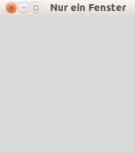
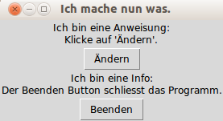
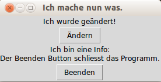
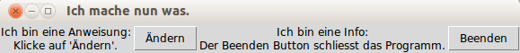
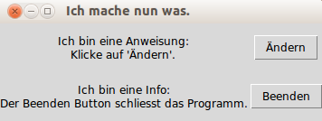
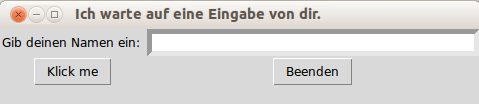
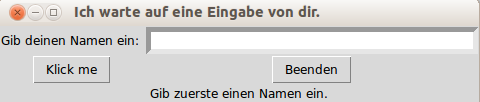
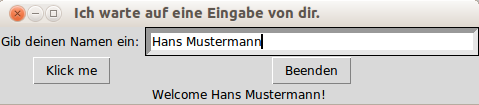
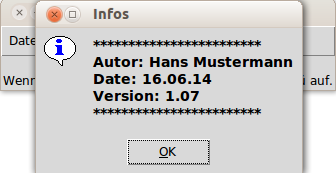
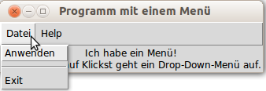

*****************************
Graphische Benutzeroberfläche
*****************************

In diesem Kapitel werden wir uns mit GUI-Programmen beschäftigen. 
GUI steht für *Graphical User Interface*.
Es handelt sich also um Programme, 
welche nicht nur mit Texteingabe und -ausgabe arbeiten, 
sondern auch eine graphische Benutzeroberfläche haben. 
In anderen Worten einfach Programme, so wie wir uns das heutzutage gewohnt sind.
Wir benutzen dazu das ``tkinter``-Modul, 
welches in Python integriert ist. 

Das Problem bei graphischen Oberflächen ist, 
dass wir das Programm nicht mehr einfach von oben nach unten durcharbeiten 
können. Wir haben ja keine Kontrolle darüber, 
auf welche Schaltfläche der Benutzer zu welchem Zeitpunkt gerade klickt. 
Darum benutzen wir für graphische Oberflächen 
sogenanntes *ereignisbasiertes Programmieren*.  
Dies bedeutet, dass das Programm nicht linear durchlaufen wird,
sondern der Programmablauf durch bestimmte Ereignisse (bei uns werden
das Klicks und Eingaben des Benutzers sein) beeinflusst wird.

Für unsere Programme heißt das, dass sie sich meistens in einer Endlosschleife 
befinden, welche nur dafür zuständig ist, darauf zu warten, 
dass der Benutzer etwas anklickt. Sobald dies geschieht 
(also ein Ereignis eintrifft) wird ein bestimmter Teil des Programms 
ausgeführt, welcher für die Aktion des Benutzers zuständig ist. 
Sobald dies geschehen ist, geht das Programm wieder in die Endlosschleife 
zurück und wartet auf weitere Aktionen. 
Diese Schleife heisst in ``tkinter`` :py:func:`mainloop`.
Im Kapitel `Einführung ins Programmieren <./einfuehrung.html>`_ bei der
letzten Aufgabe haben wir bereits ein erstes GUI-Beispiel gesehen.

Im folgenden werden wir Stück für Stück ein GUI erstellen. 
Beginnen werden wir mit einem einfachen Fenster und dann kontinuierlich 
weitere Komponenten kennenlernen.

Fenster
=======

Um eine graphische Benutzeroberfläche zu gestalten,
brauchen wir als allererstes ein Fenster. Um ein solches zu erstellen
benutzen wir, wie bereits erwähnt, dass ``tkinter``-Modul von Python,
welches uns das nötige Werkzeug zur Verfügung stellt. 
Dies geschieht wie gewohnt mit dem ``from-import`` Befehl:

	.. code-block:: python
		
		from tkinter import *

Nun erstellen wir mit :py:func:`Tk` ein Fenster:

	.. literalinclude:: code/gui/fenster.py
   		:linenos:

Lassen wir das Programm laufen, bekommen wir ein leeres Fenster wie z.B.
	
	|fenster|
	     
Das ist natürlich noch nicht so interessant, denn dieses Fenster
wartet nur, bis es geschlossen wird. Aber nun können wir beginnen,
dieses Fenster mit weiteren Komponenten zu bepacken.

.. note:: Je nach Betriebssystem, welches man benutzt, wird
	  das Fenster anders aussehen. Das obige Programm wurde auf einem
	  Rechner mit Ubuntu/Linux ausgeführt und hat somit ein Fenster 
	  mit obigem Design erstellt. Auf einem Windows oder OS X Rechner
	  wird es anders aussehen. Dies wird auch bei den folgenden 
	  Themen so sein und bleiben.

Buttons und Labels
==================

Nun fügen wir unserem Fenster einige neue Elemente hinzu. 
Wir beginnen hier mit zwei Buttons und einem Label.
Ein Label bietet uns die Möglichkeit einen Text auf dem Fenster anzeigen zu
lassen, welcher dem Benutzer z.B. Informationen oder Anweisungen 
mitteilen kann. Der erste Button soll beim Draufklicken den Infotext
ändern und der zweite Button ist ein klassischer *Beenden*-Button, 
der das Programm beendet. Solche Elemente werden folgendermaßen erstellt:

	.. code-block:: python

		my_button = Button(fenster, option=value, ... )
		my_label = Label(fenster, option=value, ... )

Das erste Argument definiert, welchem Fenster die jeweilige Komponente 
hinzugefügt wird. Mit den darauf folgenden Argumenten können wir 
unsere Komponente wie gewünscht einstellen, z.B. Grösse, Text, Farbe, 
Textfarbe. [#]_ 

.. attention::	Wir benutzen hier Python 3 und da gibt es manchmal
		kleine Unterschiede zu Python 2.7. Zum Beispiel:

			.. code-block:: python
		
				# Python 3
				from tkinter import *	

			.. code-block:: python

				# Python 2.7
				from Tkinter import *

Wichtig für das Button-Objekt ist die ``command``-Option. 
Ist diese nicht vorhanden, so passiert beim Draufklicken auf den Button
gar nichts. Also definieren wir mit :py:keyword:`def` eine Funktion, 
welche dem Button mit der ``command``-Option als Funktion für das 
Klick-Ereignis übergeben wird. Mit der Funktion :py:func:`pack`
können wir die einzelnen Komponenten dem Fenster übergeben.
Unser Programm sieht dann folgendermaßen aus:

	.. literalinclude:: code/gui/label_button.py
   		:linenos:
		:emphasize-lines: 14-22

Beim Ausführen erhalten wir das erste Bild und 
nach dem Klick auf den *Ändern*-Button das zweite:

	|label1| |label2|

Bei einem Klick auf den *Beenden*-Button wird das Fenster und somit auch das 
Programm beendet.

Geometrie-Manager
=================

Wir haben oben gesehen, dass mit der Funktion :py:func:`pack` die 
Komponenten dem Fenster hinzugefügt wurden.
Doch wie sollen die einzelnen Komponenten auf dem Fenster
angeordnet werden?
Für solche Angelegenheiten bietet ``tkinter``
drei verschiedene Geometrie-Manager an: 

	- pack
	- grid
	- place

Die drei Layout-Manager *pack*, *grid* und *place* ordnen die 
verschiedenen Komponenten auf dem Fenster an, 
jeder auf seine Weise. Sie sollten jedoch nie im gleichen 
Fenster gemischt werden. 
Wie sie genau funktionieren und was die Unterschiede zwischen diesen 
drei Layout-Managern sind, sehen wir gleich.

pack
~~~~

*Pack* ist der am einfachsten zu benutzende der drei Geometrie-Manager.
Statt dass man präzise erklären muss, wo eine Komponente auf dem Bildschirm 
erscheinen soll, werden sie relativ zueinander positioniert. 
Die Details werden von *pack* automatisch bestimmt.
Man kann nur wenig selber bestimmen und ist deshalb in seinen 
Möglichkeiten im Vergleich zu den anderen Geometrie-Managern eingeschränkt.
Hier eine Möglichkeit:

	=======		=========================================
	Option:		Beschreibung:
	=======		=========================================
	side		Bestimmt auf welcher Seite die Komponente
			gepackt werden soll: TOP (default), 
			BOTTOM, LEFT, or RIGHT.
	=======		=========================================

Auf das obige Beispiel angewandt, können wir nun unsere Buttons und Labels
nebeneinander statt untereinander platzieren:

	.. code-block:: python

		# Die Komponenten nebeneinander platzieren
		anweisungs_label.pack(side=LEFT)
		change_button.pack(side=LEFT)
		info_label.pack(side=LEFT)
		exit_button.pack(side=LEFT)

Die führt zu folgendem Layout:

	|pack|

Möchte man die Komponenten aber nur etwas anders platzieren, wird es 
mit dem *pack*-Manager schon recht mühsam. Da ist der *grid*-Manager um einiges 
angenehmer.

grid
~~~~

Der *grid*-Geometrie-Manager platziert die Komponenten in einer 
2-dimensionalen Tabelle, die in Reihen und Spalten angeordnet ist. 
Die Position einer Komponente wird durch einen ``row`` und einen ``column``-Wert 
bestimmt. Komponenten mit der selben column-Zahl und verschiedenen row-Zahlen 
werden übereinander angeordnet. Entsprechend werden Komponenten mit der 
selben row-Zahl und verschiedenen column-Zahlen in der selben Zeile platziert, 
d.h. sie stehen nebeneinander, also rechts und links voneinander. 

Mit der *grid*-Methode übergibt man den row- und den column-Wert, 
wo die Komponente platziert werden soll. 
Die Größe braucht nicht definiert zu werden, 
da der Grid-Manager automatisch die Ausdehnungen
für die benutzten Komponenten berechnet.

	=======		=========================================
	Option:		Beschreibung:
	=======		=========================================
	row		Bestimmt in welcher Zeile man die
			Komponente setzen möchte.

	column		Bestimmt in welcher Spalte man die
			Komponente setzen möchte.

	padx		Diese Option kann man gebrauchen, wenn man
			in der Horizontalen noch zusätzlich 
			etwas Abstand an die jeweilige Komponente
			einbauen möchte.

	pady		Analog wie padx, einfach in der 
			Vertikalen
	=======		=========================================

Mit dem Grid-Manager lässt sich nun einfach definieren, wo man die 
einzelnen Komponenten platzieren möchte.

	.. code-block:: python

		# Label und entsprechender Button nebeneinander
		# mit etwas Abstand zur anderen Label-Button-Gruppe
		anweisungs_label.grid(row=0, column=0, pady = 20)
		change_button.grid(row=0, column=1, pady = 20)
		info_label.grid(row=1, column=0)
		exit_button.grid(row=1, column=1)

Und dies sieht dann so aus:
	
	|grid|

place
~~~~~
Der Place-Geometrie-Manager erlaubt das explizite Setzen der Position 
und der Grösse eines Fenster, entweder in absoluten Werten oder relativ zu 
anderen Komponenten. 

	===========		==========================================
	Option:			Beschreibung:
	===========		==========================================
	x, y			*Absolute Positionierung*:
				Horizontale und vertikale Koordinate (in
				Pixel), in welcher die Komponente gesetzt 
				wird.

	relx, rely		*Relative Positionierung*:
				Horizontale und vertikale Platzierung 
				bezüglich des Fensters, in welches 
				die Komponente gepackt wird. Der Wert 
				muss zwischen 0.0 und 1.0 liegen.

	height			Höhe der Komponente bestimmen (in Pixel)

	width			Breite der Komponente bestimmen (in Pixel)
	===========		==========================================

Dieser Manager ist im Verlgeich zu den anderen beiden der aufwendigste.
Man sollte ihn nur dann benutzen, wenn es nicht anders geht.
Hier ein Beispiel:

	.. code-block:: python

		# Zuerst definieren wir die Grösse des Fensters
		fenster.geometry("450x400")
		# Wir benutzen die absoluten Koordinaten um die Komponenten zu
		# setzen und definieren deren Grösse
		anweisungs_label.place(x = 0, y = 0, width=200, height=150)
		change_button.place(x = 220, y = 0, width=200, height=150)
		info_label.place(x = 100, y = 160, width=300, height=100)
		exit_button.place(x = 100, y = 260, width=300, height=100)

Ausgeführt sieht es dann folgendermaßen aus:

	|place|

Natürlich kann man noch viel mehr machen, doch das würde den Rahmen dieses
Tutorials sprengen. Im Internet finden sich zu allen drei 
Geometrie-Managern noch viele weitere interessante 
Beispiele und Einstellungsmöglichkeiten.

Eingabefeld
===========

Bis jetzt hatte der Benutzer nur die Möglichkeit, über Button-Klicks mit dem 
Programm zu interagieren. Nun werden wir sehen, wie der Benutzer 
über ein Feld eine Eingabe machen kann, welche das Programm danach 
verarbeiten kann. Die Syntax, um ein solches Eingabefeld zu erstellen, sieht
folgendermaßen aus:

	.. code-block:: python

		eingabefeld = Entry(fenster, option, ... )

Wir sehen nun gleich ein Programm, welches im Fenster auf die Eingabe 
des Benutzers wartet und danach eine entsprechende Ausgabe generiert:

	.. literalinclude:: code/gui/entry.py
   		:linenos:
		:emphasize-lines: 23,24

Wird das Programm ausgeführt, so bekommen wir folgendes Fenster:

	|entry|

In Zeile 7 im obigen Programm wird überprüft, 
ob der Benutzer etwas in das Feld geschrieben hat
oder nicht. Dementsprechend sieht dann die Ausgabe im Fenster 
nach dem Klick auf den *Klick me*-Button jeweils anders aus:

=============			============
Ohne Eingabe:			|entry_leer|
Mit Eingabe:			|entry_name|
=============			============

Menü und Messagebox
===================

Bei den meisten Programmen ist man es gewohnt, dass man am oberen Fensterrand
ein Menü zur Verfügung hat. Wie man ein solches erstellt, sehen wir in diesem 
Kapitel. Wir werden ein *Pull-down-Menü* mit ``tkinter`` erstellen. 
D.h. dass z.B. ganz oben im Fenster, wenn auf die Fläche *Datei* geklickt wird, 
ein *Pull-down-Menü* mit einigen Auswahlmöglichkeiten erscheint, wie z.B.
*Speichern*, *Speichern unter* oder *Exit*. 
Die Syntax dazu sieht folgendermaßen aus:

	.. code-block:: python

		my_menu = Menu(fenster, option, ... )

In unserem Beispiel erstellen wir eine Menüleiste mit den Einträgen 
*Datei* und *Help*. Beim Klick auf *Datei* soll ein *Drop-Down*-Menü 
aufgehen mit den Einträgen *Anwenden* und *Exit*. 
Wenn man auf *Anwenden* klickt, wird ein Text auf der Konsole ausgegeben und 
bei *Exit* wird das Programm natürlich beendet. Bei *Help* soll ein Eintrag 
*Info!* erscheinen, welcher eine ``Messagebox`` öffnet.
Die ``Messagebox`` ist lediglich ein weiteres Fenster, welches 
Informationen enthalten kann und beim Klick auf ``OK`` wieder geschlossen wird.
Eine ``Messagebox`` kann z.B. so aufgerufen werden:

	.. code-block:: python

		from tkinter import messagebox
		messagebox.showinfo(message="Infotext", title = "Box-Titel")

Dies alles in einem Programm umgesetzt
kann dann folgendermaßen aussehen:

	.. literalinclude:: code/gui/menu.py
   		:linenos:
		:emphasize-lines: 2, 14, 23-44

Ausgeführt kann es dann so aussehen
	
	|menu|

und bei Klick auf *Help -> Info!*

	|box|

Nun haben wir hier ein paar wichtige Komponenten kennengelernt, mit welchen
man eine einfache graphische Benutzeroberfläche erstellen kann. 
Natürlich gibt es noch viele weiere Komponenten, welche man gebrauchen kann.
Jedoch sollte man nach diesem Kapitel in der Lage sein, 
den Gebrauch der restlichen Kompenten selber herauszufinden,
natürlich mit der Hilfe des Internets. 

.. rubric:: Footnotes
	
.. [#]	Für diese und auch alle weiteren Komponenten im Verlauf des Tutorials 
	gibt es jeweils eine ganze Menge Optionen einzustellen. 
	In den Beispielen werden jedoch nur ein paar gezeigt. 
	Ein vollständigere Auflistung der verschiedenen Optionen der
	jeweiligen ``tkinter``-Komponente findet sich z.B. auf
	http://www.tutorialspoint.com/python/python_gui_programming.htm 

.. |place| image:: images/gui/place.png 

