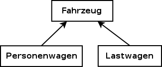
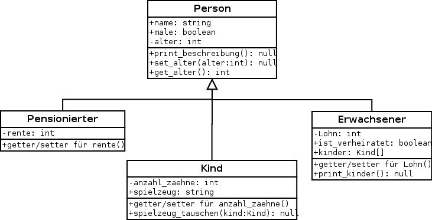

*******************
Objekte und Klassen
*******************

Je grösser ein Programm wird, desto wichtiger ist es Ordnung zu halten.
Eine Konzept, um die Übersicht besser zu behalten, ist die *Modularisierung*. 
Das heisst, dass wir unser Programm in einzelne, kleinere Komponenten 
aufteilen. Im Kapitel zu `Funktionen <./funktion.html>`_ haben wir bereits eine 
mögliche Variante der *Modularisierung* gesehen, indem die Ausführung 
von gewissen Codezeilen einer Funktion übergeben wurde.

In diesem Kapitel beschäftigen wir uns mit Objekten und Klassen [#]_. Die Idee 
dahinter ist, dass unsere Welt aus Objekten besteht, wie z.B. Personen, Autos,
Bäume, Häuser, Länder, Werkzeuge und Schuhe. Jedes dieser Objekte hat
bestimmte Charakteristiken und kann andere Objekte beeinflussen.
Dies ist eine sehr intuitive Beschreibung des Konzepts der obejektorientierten 
Programmierung. Im folgenden sehen wir anhand einiger Beispiele  eine konkrete 
Umsetzung in unserer Programmiersprache.

Klassen definieren und Objekte erstellen
========================================
Gehen wir von einem Programm aus, welches Informationen über Personen verwaltet.
Jede einzelne Person kann im Programm durch ein *Objekt* repräsentiert werden. 
Ein solches Objekt kann somit eine vereinfachte 
Kopie einer Person aus der realen Welt darstellen. 
Mit dem Keyword :py:keyword:`class` kann nun eine Klasse
definiert werden, welche mir Objekte von dieser Klasse generieren.
Die einfachste Weise dies zu machen, sieht folgendermassen aus:

.. literalinclude:: code/oop/einf_klasse_pass.py
   :linenos:

Nun können Objekte (Instanzen) der Klasse :py:class:`Person` erstellt werden.

>>> p1 = Person()
>>> p1
<__main__.Person object at 0x33c9210>

Man sieht das ``p1`` nun eine Instanz der Klasse :py:func:`Person` ist. 
Es könnten theoretisch noch viele weitere Instanzen unserer Klasse
:py:func:`Person` erstellt werden.

Instanzvariablen
================

Jede Person ist auf seine Art einzigartig und besitzt
gewisse Eigenschaften (z.B. Name, Vorname, Geburtsdatum und Körpergewicht).
Diese Variablen, welche wir nur innerhalb der Person ``p1`` definieren
wollen, können wir auf folgende Art erstellen:

>>> p1.name = "Müller"
>>> p1.vorname = "Kurt"
>>> p1.geb_datum = "03.02.01"
>>> p1.gewicht = "73.5 kg"

Variblen welche zu einem Objekt gehören, werden **Instanzvariablen** genannt.
Möchte man nun z.B. den ``namen`` und den ``vornamen`` der Person ``p1`` wissen,
so kann dieser mittels ``p1.name`` (bzw. ``p1.vorname``) abgefragt werden.

>>> print(p1.name, p1.vorname)
Müller Kurt

Eine Eingabe in der Konsole wie z.B.

>>> print(name, vorname)

wird nicht den Namen "Müller Kurt" unserer gewünschten Person ``p1``  ausgeben,
da diese nur im Namensbereich unseres Objektes  ``p1`` existieren.

Einer Instanz kann man beliebige Variablenamen zuordnen. 
Jedoch sollten sie schon irgendwie Sinn machen, weil es sonst 
im weiteren Programmverlauf nur
zur Verwirrung führt.

.. note:: Die Instanzvariablen, welche wir hier erstellt haben
          ( ``name``, ``vorname``, ``geb_datum`` und ``gewicht``)
	  charakterisieren die Instanz ``p1`` der Klasse :py:class:`Person`.
	  Diese helfen verschiedene Instanzen der gleichen Klasse zu
	  unterscheiden.
	  Später werden wir auch noch **Klassenvariablen** sehen, 
          welche nicht ein Objekt, sondern die Klasse selbst beschreibt.

Aufgaben
~~~~~~~~
1. Wir haben folgendes Programm gegeben:

   .. code-block:: python
      :linenos:

      class Person:
    	  pass

      my_person1 = Person()
      my_person2 = Person()
      my_person1.vorname = "Patrick"
      my_person2.name = "vonBerg"
      
   Erkläre warum folgende Eingaben nicht funktionieren.

   >>> print(my_person1.name)
   >>> print(my_person2.vorname) 

2. Erstelle eine Instanz der Klasse :py:class:`Person` und nenne das Objekt
   ``dummy``. Erstelle für ``dummy`` folgende Instanzvariablen: 
   ``name = "Müller"``, ``vorname = "Jürg"``.
   Überlege zuerst was bei den folgenden Eingaben herauskommen sollte und 
   kontrolliere es dann, indem du es laufen lässt.
   Interpretiere die Resultate.

   .. code-block:: python
      :linenos:
      
      print(dummy.vorname, dummy.name)
      x = dummy
      x.vorname = "Giovanni"
      print(dummy.vorname, dummy.name)

3. Erkläre was im folgenden Programm gemacht wird:

   .. code-block:: python
      :linenos:
      :emphasize-lines: 11

      class Person:
      	pass

      class Auto:
	pass

      dummy = Person()
      my_car = Auto()
      my_car.marke = "Seat"
      dummy.car = my_car
      print(dummy.car.marke)

Die :py:func:`__init__()` Methode
=================================
Von oben ist eigentlich klar, dass es vielleicht keinen Sinn macht,
Personen ohne Identität (sprich ohne Instanzvariablen) herzustellen. 
Es wäre also nur logisch, 
wenn man bei der Herstellung eines ``Objekts``, die Instanzvariablen,
welche man auf sicher haben möchte, von Anfang 
an definieren könnte. 
In unserem Beispiel würde das heissen, dass wir der Person
gleich bei der Herstellung eine Identität geben.
Dies kann man machen, wenn in der Klasse die Funktion :py:func:`__init__()` 
existiert. Die Funktion :py:func:`__init__()` wird immer dann aufgerufen,
wenn neue Objekte der Klasse instanziert werden 
(z.B. ``per = Person(...)``). [#]_
Die gewünschte Belegung der Instanzvariblen können 
der Funktion :py:func:`__init__()` einfach als Argumente übergeben werden. 
Auf unser Beispiel von oben angewandt, sieht es dann so aus:

.. literalinclude:: code/oop/einf_klasse_init.py
   :linenos:
   :lines: 1-9

Auf diese Weise kann keine Person ohne Identität erstellt werden und
man kann sicherstellen, dass die geforderten Instanzvariablen (hier
``name``, ``vorname``, ``geb_datum`` und ``gewicht``) auch sicher existieren.
Erstellen wir nun eine neue Person: 

>>> p2 = Person("Smith", "John", "04.04.04", "83 kg")
>>> print(p2.name, p2.vorname, p2.geb_datum, p2.gewicht)
Smith John 04.04.04 83 kg

Die Person ``p2`` wurde instanziert und die geforderten Instanzvariablen 
sind garantiert belegt.

.. note:: Das erste Argument ``self`` bei :py:func:`__init__()`
          ist eine Referenz auf das Objekt.
	  Auf diese Weise ist z.B. die Zuordnung in der Klasse :py:class:`Person` 
		
	  .. literalinclude:: code/oop/einf_klasse_init.py
   	     :lines: 6

	  unmissverständlich. Das heisst ``self.name`` steht für die 
	  Instanzvariable des Objekts, welches erstellt wird und ``name`` 
	  steht für das Argument welches der Funktion :py:func:`__init__()`
	  übergeben wird. Natürlich kann man die Argumente auch anders
	  benennen. Jedoch sollte klar ersichtlich sein, welches Argument 
          zu welcher Instanzvariable gehört.

Klassenmethoden
================
Menschen sind nicht nur Träger von Merkmalen (Name, Vorname etc.), sondern 
besitzen auch ein Verhalten (z.B. "sich Vorstellen" oder "Gewicht abnehmen").
Solche Verhaltensweisen können in Methoden/Funktionen innerhalb der Klasse 
definiert werden. Von oben haben wir gesehen, dass wir mit 

>>> print(p2.name, p2.vorname, p2.geb_datum, p2.gewicht)
Smith John 04.04.04 83 kg

auf die Instanzvariablen des Objekts zugreifen können. Jetzt möchte man aber 
nicht immer einen solch langen ``print``-Befehl eingeben, 
sondern das Objekt (hier eine Person) soll sich gleich selber vorstellen.
Dies kann auf folgende Weise innerhalb der Klasse :py:class:`Person`
realisiert werden:

	.. literalinclude:: code/oop/einf_klasse_init.py
   	   :linenos:
	   :lines: 1-18

Wir haben also innerhalb der Klasse eine Funktion definiert. Das Argument 
``self`` in der Klammer ist, wie schon bei der Funktion :py:func:`__init__()`,
eine Referenz auf das Objekt, auf welche diese Funktion angewendet wird. [#]_ 

Auf diese Weise bekommen wir, ohne viel Tipparbeit, gleich die Informationen
der jeweiligen Personen, indem sie sich selber vorstellt.
Wenden wir die Methode :py:func:`vorstellen` auf die beiden Personen 
``p1`` und ``p2`` von oben an, so erhalten wir:

>>> p1.vorstellen()
Hallo.
Ich heisse Kurt Müller, wiege 73.5 kg und habe am 03.02.01 Geburtstag.
Nice to meet you.
>>> p2.vorstellen()
Hallo.
Ich heisse John Smith, wiege 83 kg und habe am 04.04.04 Geburtstag.
Nice to meet you.

Hier sehen wir, dass die Funktion :py:func:`vorstellen`, je nach Objekt
auf welches es angewandt wird, eine andere Ausgabe in der Konsolo produziert.
Das ist auch wünschenswert, denn jedes Objekt (hier jede Person) hat andere
Eigenschaften (z.B. Name und Gewicht) 
und stellt sich dementsprechend auch anders vor.

Nun kann eine Person sich nicht nur vorstellen, sondern sie kann auch 
Gewicht verlieren, z.B. wenn sie Sport getrieben hat.
Ein solches Verhalten können wir ebenfalls in der Klasse mit einer Funktion
:py:func:`abnehmen` simulieren:

	.. literalinclude:: code/oop/einf_klasse_init.py
   	   :linenos:

Anders als die Funktion :py:func:`vorstellen` (welche nur Informationen 
auswirft) verändert die Funktion
:py:func:`abnehmen` das Objekt, indem es die Instanzvariable ``gewicht``
des Objektes anpasst.
Dessen muss man sich immer Bewusst sein. 
Ist die gewünschte Änderung des Objektes wirklich im Sinne meines Programms?

>>> p1.gewicht
'73.5 kg'
>>> p1.abnehmen(3)
Altes Gewicht: 73.5 kg
Neues Gewicht: 70.5 kg
>>> p1.gewicht
'70.5 kg'

Das obige Beispiel zeigt, dass das Objekt (hier die Person ``p1``),
nach dem Aufruf der Funktion :py:func:`abnehmen`, verändert wurde.

.. note:: Die Instanzvariablen der Klasse :py:class:`Person` 
          (``name``, ``vorname``, ``geb_datum`` und ``gewicht``) 
          sowie die Klassenmethoden 
	  (:py:func:`vorstellen` und  :py:func:`abnehmen`) sind nur Objekten
	  derselben Klasse vorbehalten.
	  Eine Eingabe wie
		
 	  >>> a = 1
	  >>> a.vorstellen()
          
	  wird eine Fehlermeldung produzieren, da ``a`` hier ein Integer ist
	  und somit die Funktion :py:func:`vorstellen` als Integer nicht kennt.

*Public-, Protected- und Private* Instanzvariablen
==================================================

Manchmal macht es Sinn, dass gewisse Instanzvariablen nicht ohne Überprüfung
einfach geändert werden können oder sie erst gar nicht gegen Aussen sichtbar
sein sollten. Nehmen wir als Beispiel folgende Eingabe:

>>> p1.gewicht = "-20 kg"

``p1`` ist eine Instanz der Klasse :py:class:`Person`, wie wir es oben schon
definiert haben. Hier wurde nun dem Gewicht der Person ``p1`` einen
negativen Wert zugeordnet, was in der Realität gar nicht vorkommen kann.

Möchte man verhindern, dass die Instanzvariablen einer Klasse von aussen
ohne weiteres geändert oder gar gelesen werden, gibt es zwei Möglichkeiten, 
die Python einem zur Verfügung stellt. 

	1) Jedes Attribut, welches mit genau einem Unterstrich beginnt, 
	   ist **protected**. 
	   In diesem Fall kann man zwar das Attribut immer noch lesen 
 	   und verändern, aber durch den Unterstrich hat man klar gemacht, 
	   dass dies *verboten* oder *nicht erwünscht* ist. 

	2) Zwingend wird die Aufforderung erst, wenn der Name eines Attributes 
	   mit zwei Unterstrichen beginnt. 
	   Ein solches Attribut wird **private** genannt und man kann ausserhalb
	   der Klasse nicht darauf zugreifen oder es verändern.

Dazu sehen wir uns folgende Beispielklasse an: [#]_

	.. literalinclude:: code/oop/private_protected.py
   	   :linenos:

Wir haben hier also folgende Situation:

+------------+--------------+----------------------------------------+ 
| Name       | Bezeichnung  | Bedeutung 		             | 
+============+==============+========================================+ 
| pub	     | *public*     | Kann von Aussen gelesen und geändert   |
|            |		    | werden.   			     |
+------------+--------------+----------------------------------------+ 
| _prot	     | *protected*  | Kann von Aussen gelesen und geändert   |
|            |		    | werden, jedoch sollte es nicht gemacht |
|	     |		    | werden (Empfehlung vom Entwickler).    |
+------------+--------------+----------------------------------------+ 
| __priv     | *private*    | Kann von Aussen weder gelesen noch     |
|            |		    | geändert werden.                       |
+------------+--------------+----------------------------------------+ 

Im folgenden Code-Snippet sehen wir sehr gut, wie sich die Entsprechenden 
Instanzvariablen verhalten:

>>> x = A()
>>> x.pub 
'Ich bin öffentlich'
>>> x.pub = "Man kann meinen Wert ändern und das ist gut so"
>>> x.pub 
'Man kann meinen Wert ändern und das ist gut so' 
>>> x._prot
'Ich bin protected'
>>> x._prot = "Man Wert kann aber sollte nicht von außen geändert werden!"
>>> x._prot
'Man Wert kann aber sollte nicht von außen geändert werden!'
>>> x.__priv
Traceback (most recent call last):
  File "<stdin>", line 1, in <module>
AttributeError: 'A' object has no attribute '__priv'

Wir sehen also, dass wir auf die Instanzvarible ``__priv`` des Objekts ``x``
keinen Zugriff erhalten.

*Setter-* und *Getter*-Methoden
~~~~~~~~~~~~~~~~~~~~~~~~~~~~~~~
Nun kann man sich fragen, wozu solche **private** Instanzvariablen gut sind.
Sehen wir uns dazu die folgende Klasse an:

	.. literalinclude:: code/oop/setter_getter.py
   	   :linenos:
	   :lines: 1-4

Wir wollen nicht, dass ein Benutzer ein Motorrad mit negativem Hubraum
modelliert. Aus diesem Grund haben wir hier die Instanzvariable ``__hubraum``
**private** gesetzt. Der Wert kann nun unter Beobachtung mit einer 
sogenannten :py:func:`setter` Methode geändert werden:

	.. literalinclude:: code/oop/setter_getter.py
	   :linenos:
	   :lines: 1-12
	   :emphasize-lines: 6-12
	   
Auf diese Weise haben wir in Zeile 6 die Kontrolle, 
dass ``__hubraum`` keine negativen
Werte annehmen kann. Um nun noch den Wert denoch abfragen zu können, 
erstellen wir zusätzlich noch eine :py:func:`getter` Methode. Dies kann dann 
so aussehen:

	.. literalinclude:: code/oop/setter_getter.py
   	   :linenos:
	   :emphasize-lines: 14, 15

In der Python-Konsole können wir die Klasse nun testen,
was dann wie folgt aussieht:

>>> toeff = Motorrad("Yamaha", 600)
>>> toeff.get_hubraum()
600
>>> toeff.set_hubraum(-300)
Error: Negativer Wert für den Hubraum! Der Wert wurde nicht geändert
>>> toeff.get_hubraum()
600
>>> toeff.set_hubraum(300)
Hubraum wurde geändert.
>>> toeff.get_hubraum()
300

Vererbung
=========
Das Konzept der Vererbung erlaubt es uns spezialisiertere Klassen 
einer allgemeinen Klasse zu erstellen. 
Die spezialisierte Klasse soll dabei alle Eigenschaften 
der allgemeinen Klasse besitzen,
so dass nur noch wenige Eigenschaften hinzugefügt werden müssen. 
Die Klasse, von welcher geerbt wird, 
nennt man **Oberklasse**, **Superklasse** oder **Basisklasse** 
und die Klasse, welche erbt, 
wird **Unterklasse**, **abgeleitete Klasse** oder **Subklasse** genannt.

So könnte z.B. die Klasse :py:class:`Fahrzeug` eine Oberklasse 
der Unterklassen :py:class:`Personenwagen` und :py:class:`Lastwagen` sein.
Jedes :py:class:`Fahrzeug` ist durch 
die ``marke``, den ``hubraum`` und die ``leistung`` charakterisiert. 
Bei den :py:class:`Personenwagen` möchte man noch zusätzlich wissen, 
wie viele Sitzplätze es hat 
und beim :py:class:`Lastwagen` wie schwer die Fracht sein darf.

	|erben|

Um im Programm zu deklarieren, 
dass die Klasse :py:class:`Personenwagen` von der Klasse :py:class:`Fahrzeug`
erbt, setzt man beim Namen der Unterklasse einfach 
den Namen der Oberklasse in Klammern (:py:class:`Personnenwagen(Fahrzeug)`).
In einem Programm könnte das folgendermassen aussehen:

	.. literalinclude:: code/oop/vererbung.py
	   :linenos:
	   :lines: 1-15
	   :emphasize-lines: 11, 14
	   
Testen wir die Klasse in der Konsole, dann könnte das so aussehen:

>>> pw = Personenwagen("Opel", 222, 100)
>>> lkw = Lastwagen("Mercedes", 5000, 300)
>>> print(pw.get_infos())
Marke: Opel, Hubraum: 222, Leistung: 100
>>> print(lkw.get_infos())
Marke: Mercedes, Hubraum: 5000, Leistung: 300

Wir sehen also, dass die beiden Unterklassen alle Eigenschaften,
d.h. alle Instanzvariablen und alle Methoden der Oberklasse geerbt haben.

Überschreiben
~~~~~~~~~~~~~
Das obige Beispiel zeigt,
dass die abgeleiteten Klassen die Eigenschaften der Oberklassen geerbt haben.
Nun möchten wir aber noch die speziellen Eigenschaften der Unterklassen 
im Programm einbauen.
Damit sind bei der Klasse :py:class:`Personnenwagen` die Anzahl Sitzplätze
und bei der Klasse :py:class:`Lastwagen` die Schwere der Fracht gemeint.

Um diese Eigenschaften zu implementieren führen wir in den 
Unterklassen eigene :py:func:`__init__` - Methoden ein.
Dies hat zur Folge, 
dass wenn wir ein Obejkt der Klasse :py:class:`Personnenwagen` erstellen,
nun nicht mehr die :py:func:`__init__` - Methoden der Klasse 
:py:class:`Fahrzeug` aufgerufen wird, sondern die der Klasse 
:py:class:`Personnenwagen`.

Um aber Code Dublizität zu vermeiden,
können wir in der Unterklasse die :py:func:`__init__` - Methode der 
Oberklasse aufrufen. 
Dies geschieht mit dem Keyword :py:func:`super`.

Ebenfalls *überschreiben* wir die Methode :py:func:`get_info` 
und passen sie auf die entsprechende Unterklasse an.

	.. literalinclude:: code/oop/vererbung2.py
	   :linenos:
	   :emphasize-lines: 13, 17, 21, 25
	   

Das Programm liefert folgenden Output: 

>>> 
Marke: Opel, Hubraum: 222, Leistung: 100, Anzahl Plaetze: 5
Marke: Mercedes, Hubraum: 5000, Leistung: 300, Lastgewicht: 2000

In Python besteht auch die Möglichkeit einer **Mehrfachvererbung**, 
d.h. dass eine Unterklassse mehr als nur eine Basisklasse besitzen kann. 
Wir gehen hier aber nicht näher darauf ein. 

Aufgaben
========

1. Überlege dir, was die Python-Konsole ausgibt, wenn folgende Programme 
   ausgeführt werden. Erkläre weshalb.
   
   Klasse 1:

   .. literalinclude:: code/oop/velo.py
      :linenos:

   Klasse 2:

   .. literalinclude:: code/oop/velo2.py
      :linenos:

2. In dieser Aufgabe wird eine Mitarbeiterdatenbank irgendeiner Firma 
   simuliert.

   a) Schreibe eine Klasse :py:class:`Mitarbeiter` mit den drei Instanzvariablen 
      ``vorname``, ``nachname`` und ``lohn``. 
      Achte darauf, dass bei der Instanzierung eines Mitarbeiters, die
      Instanzvariablen auch sicher belegt werden.

   b) Erstelle in der Klasse :py:class:`Mitarbeiter` Methoden mit folgenden 
      Funktionalitäten:
      
      i) :py:func:`get_mitarbeiter_id`

         Diese Methode soll auf der Konsole folgendes rausgeben, wenn sie 
         auf einen Mitarbeiter angewandt wird:
	
	 *"Ich heisse Hans Mustermann. 
         Mein Lohn bei dieser Firma beträgt 100 sfr."*

      ii) :py:func:`lohn_erhoehen`

	  Beim Ausführen dieser Methode, erhälte der jeweilige Mitarbeiter einen
          höheren Lohn. Wie viel mehr Lohn er erhält, kann als Argument der 
	  Methode übergeben werden.

      iii) :py:func:`lohn_senken`

           Hier wird, wie der Name schon sagt, der Lohn gesenkt. Um wie viel 
           der Lohn gesenkt wird, kann wiederrum als Argument der Methode 
           übergeben werden. Zusätzlich gibt die Methode einen ``String`` 
           zurück, welcher mitteilt, ob die Senkung erfolgreich war, oder nicht.
	   Denn falls der Lohn bei der Senkung unter 3500 sfr. fällt,
	   so wird das Unterfangen abgebrochen. Dies könnte dann 
           z.B. so aussehen:
	   
	   >>> info = arbeiter.lohn_senken(200)
           >>> print(info)
           Erfolg: Der Lohn wurde um 200 sfr. gesenkt und beträgt nun 3600 sfr.
	   >>> info = arbeiter.lohn_senken(150)
           >>> print(info)
           Error: Der Lohn kann wegen der Mindestlohninitative nicht gesenkt werden. 
           Er bleibt bei 3600 sfr. 
           Bitte mit der Gewerkschaft reden.

      iv) :py:func:`get_initialen`
	
	  Die Methode gibt lediglich die Initalen des betroffenen Mitarbeites 
          zurück. Bei einem Mitarbeiter mit dem Namen *Hans Müller* wäre das 
          also *H.M.* Baue diese Methode auch in der bereits erstellten Methode
	  :py:func:`get_mitarbeiter_id` ein, um z.B. folgende Ausgabe zu 
          erstellen:

	  *"Ich heisse Hans Mustermann (alias H.M.). 
          Mein Lohn bei dieser Firma beträgt 100 sfr."*

   c) Test dein Programm.

3. **Brüche**

   a) Definiere eine Klasse :py:class:`Brueche`, 
      welche eine Bruchzahl modelliert. Die Klasse soll die Instanzvariablen 
      ``zaehler`` und ``nenner`` vom Typ ``Integer`` besitzen.
      Stelle immer sicher, dass der Nenner nicht den Wert 0 annehmen kann.

   b) Füge der Klasse eine Methode mit dem Namen :py:func:`print_wert` hinzu, 
      welche keine Parameter erwartet und den Wert des Bruches auf der Konsole
      ausgibt. Die Ausgabe konnte zum Beispiel so aussehen:

      	*"Der Wert des Bruches beträgt 2/3."*

   c) Füge der Klasse eine weitere Methode hinzu und zwar
      mit dem Namen :py:func:`add`. Diese Methode erhält als Argument ein
      Objekt derselben Klasse :py:class:`Brueche` und addiert diesen mit dem
      Bruch-Objekt, auf welche die Methode angewandt wird.
      Speichere das Resultat in ein neues Objekt der Klasse :py:class:`Brueche`
      und gib es als ``return`` zurück.

   d) Das gleiche Prinzip wende nochmals für die Methode :py:func:`multiply`
      an.

   e) Füge noch eine Methode :py:func:`kuerzen` hinzu, welche 
      den referenzierten Bruch kürzt, falls möglich. 
      Erweitere mit ihr die Methoden :py:func:`add` 
      und :py:func:`multiply`.
      
   f) Definiere noch eine letzte Methode :py:func:`equal`.
      Die Methode soll wahr zurückliefern, sofern der übergebene 
      Bruch dem gleichen Wert wie dem aufgerufenen Bruch entspricht.
	  
4. Mache dich z.B. im Internet über das Thema **Operatorüberladung** schlau.
   Benutze das Wissen um für die Klasse :py:class:`Brueche` von oben
   die Addition mittels des "+"-Operators zu definieren.
   Mache das gleiche auch für den "*"-Operator und den "=="-Operator.

5. **Vererbung**

   Gegeben sei das folgende Klassendiagramm:

		|erben_personen|

   Hinweise zum Diagramm:

   - Der Pfeil bedeutet: *"Erbt von"*
   - Im obersten Teilkästchen wird jeweils der Klassenname notiert. 
     Anschliessend folgen die Instanzvariablen und zum Schluss die Methoden.
   - Instanzvariablen werden gemäss der folgenden Notation illustriert:
  
     `<+/-> <name> : <type>`
  
     wobei ein + für *public* und ein - für *private* steht.
   - Analog bei Methoden: 

     `<+/-> <name>(<parameter>) : <return-type>`

   Implementiere alle Klassen gemäss dem Klassendiagramm.
   Die Methode :py:func:`print_beschreibung` 
   soll eine kurze Beschreibung ausgeben:

   *"Ich heisse Hans Muster, bin männlich, 70 Jahre alt und Pensionär(in)."*

   Achte darauf, dass das Alter eines Erwachsenen zwischen 18 und 61 Jahre 
   beträgt. Kinder sind jünger als 18 Jahre und die Pensionierten älter als 
   61 Jahren.
   
   Die Funktion :py:func:`print_kinder` in der Klasse :py:class:`Erwachsener`
   gibt die Namen der Kinder auf der Konsole aus, falls sie überhaupt 
   Kinder besitzt.
   
   Vermeide Code Dublizität.
   

.. rubric:: Footnotes
	  
.. [#] Die Verwendung von Objekten und Klassen wird *objektorientierte 
       Programmierung* (kurz *OOP*) genannt. Für eine umfassende Beschreibung
       siehe z.B. unter http://openbook.galileocomputing.de/oop/ nach.

.. [#] Diejenigen die vielleicht mal in Java programmiert haben, 
       könnten meinen, dass es sich bei :py:func:`__init__()` um einen
       Konstruktor handelt. Jedoch ist die Sache in Python etwas anders.
       Der eigentliche Konstruktor wird implizit von Python gestartet 
       und :py:func:`__init__()` dient, 
       wie der Name andeutet der Initialisierung der Attribute. 
       Die :py:func:`__init__()`-Methode wird jedoch unmittelbar 
       nach dem eigentlichen Konstruktor gestartet 
       und dadurch entsteht der Eindruck, 
       als handele es sich um einen Konstruktor.
.. [#] Man könnte auch einen anderen Namen als  ``self`` verwenden 
       (z.B. ``this``). Denn über diesen Parameter erhält die Methode 
       beim Aufruf eine Referenz auf das Objekt für welches sie aufgerufen wird.
       Es ist aber in Python üblich, dass der Name ``self`` verwendet wird.
.. [#] Beispiel aus http://www.python-kurs.eu/python3_klassen.php
   
   
   
        

